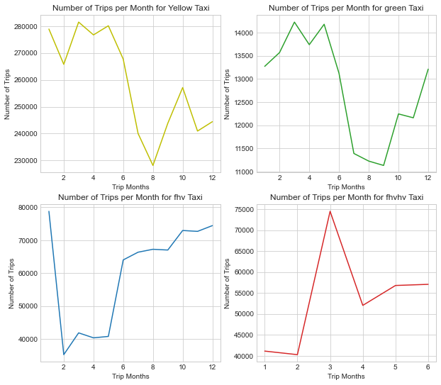
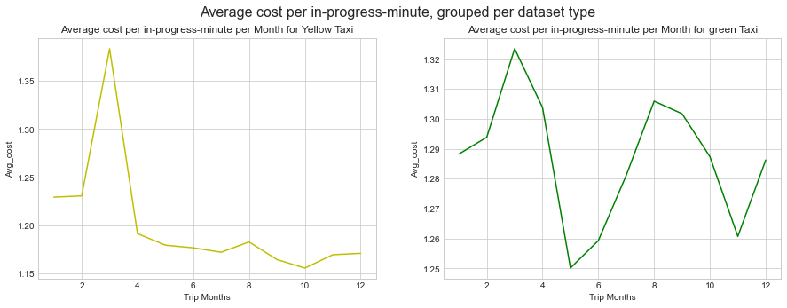
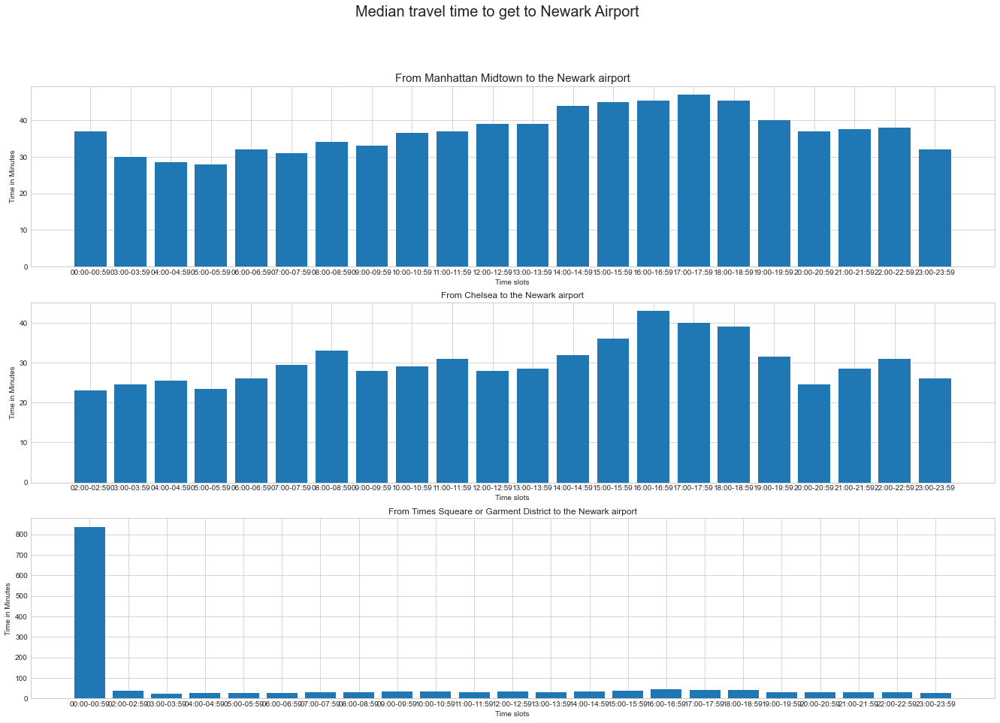

#### Authors: Kubam Ivo Mbi and Berdai Hasnae
## Introduction
The New York City Taxi and Limousine Commission (TLC) was created in 1971. This agency is responsible for licensing and regulating New York City's Medallion (Yellow) taxi cabs, for-hire vehicles (community-based liveries, black cars and luxury limousines), commuter vans, and paratransit vehicles opereate in the city. It is approximated that about one million trips are recorded each day. There are Four types of trips broken down into Yellow Taxi, Green Taxi, For-Hire Vehicle (FHV) and High Volume For-Hire Vehicle (FHVHV). TLC receives taxi trip data from the technology service providers (TSPs) that provide electronic metering in each cab, and FHV trip data from the app, community livery, black car, or luxury limousine company, or base, who dispatched the trip. Visit [About TLC](https://www1.nyc.gov/site/tlc/about/about-tlc.page) for more info. 
## Project Objective
This project was aimed at using the tools and knowledge acquired in the course to do data wrangling and analysis of a sampled subset of data from the TLC database. This objective was broken down into the following tasks: 
> - [**Collecting metadata, inspecting schema evolution:**](https://github.com/MSBGDA/INFO-H-600-Project-Group-AH/blob/main/t1_explore.ipynb) Understanding the data and its characteristics
> - [**Data integration:**](https://github.com/MSBGDA/INFO-H-600-Project-Group-AH/blob/main/t2_integrate.ipynb) Updating old schemas to the latest schema for each subdatset
> - [**Data Cleaning**](https://github.com/MSBGDA/INFO-H-600-Project-Group-AH/blob/main/t3_clean.ipynb) Checking files for record errors, repairing them and separting into good and bad records.
> - [**Analysis:**](https://github.com/MSBGDA/INFO-H-600-Project-Group-AH/blob/main/t4_analysis.ipynb) Answering queries and plotting results using matplotlib

 See the assignment file for more details about the above objectives. 
## Methodology
### About the Dataset
The dataset used in this project was generated by uniformly sampling 0.2\% without repetition from each file per taxi trip types. The sampled dataset consist of records from 2009 with just the Yellow taxi uptil 2020 with all four taxi records included. The four sub-datasets representing the four trip types do not provide the same information. More information is provided by the data dictionaries found on the [TLC Trip Record Data](https://www1.nyc.gov/site/tlc/about/tlc-trip-record-data.page) 

## Highlight of Results
 

#### The monthly total number of trips, grouped per dataset type

 
In general, yellow taxi had the highest number of trips per month lookinga at the y axis scale. Yellow and green taxi almost had similar pattern in the number of trips per month with high values in the first two quarters and a drop in the third quarter and slow rise in the last quarter. FHV started high in January, a fall in Febraury till April and a rise from June till the end of the end. No recognise pattern for FHVHV as we had records only for one and a half hear. Eventhough the scales of y-axis can guide in getting the numerical values behing the plots, see exact values in other notebook.  
  
#### Average cost per in-progress-minute

 
The Average cost per in progess minute for yellow taxi was consistenly low when compared to that of green on a monthly base except for the month of March with **\\$1.38 vs \\$1.32** per minute. So, yellow taxi service is averagely cheaper comparatively. 

#### Time Taken to get to Newark Airport

 
Taxi trips duration from Manhattan Midtown and Chelsea to Newark Airport showed similar patterns. The early mornings and late evenings were the best time to take a drip to Airport while the Afternoons and early evenings were the worst time to take a drip to the Airport. We will like to stress here that, trips from Times Squeare or Garment District also showed similar pattern but due to two trips that recorded unusual trip duration caused the left skewed data display.  
The exact best time slots to travel to the Newark airport were ***05:00-05:59*** from Manhattan, ***02:00-02:59*** from Chelsea and ***03:00-03:59*** from Times Squeare or Garment District. Their corresponding worst time slots were ***17:00-17:59, 16:00-16:59, 16:00-16:59*** respectively. We decided not to consider ***00:00 - 00:59*** as the worse time slot for Times Squeare or Garment District because those two trips were outliers.  
The monthly median travel time for the best and worst time slots  plots can be found other notebook. 

### Related Projects
> - [**New York Taxi Visualization**](https://github.com/ivombi/NY-Taxi)
